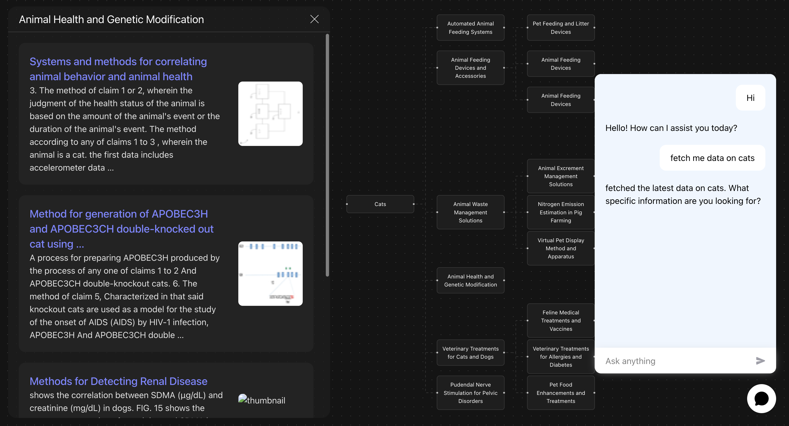

# AxiGraph

AxiGraph is a research tool that helps you explore academic papers visually. Simply ask a question about any topic, and the system finds 40+ relevant papers, analyzes them, and creates an interactive mind map showing how different concepts connect. This makes it easy to understand the big picture, discover related topics, and find the papers you need—all in one place.



## How It Works

1.  **User Query:** The user asks the chatbot a research question (e.g., "Fetch me data on cats").
2.  **Data Retrieval:** The agent fetches 40+ papers related to the query using SerpApi.
3.  **Scraping & Processing:** For each link, the system scrapes the title and abstract.
4.  **Embedding & Clustering:**
    - Vector embeddings are generated using OpenAI's text embedding model.
    - Concepts are clustered using Scikit-learn (K-Means algorithm and cosine similarity).
5.  **Visualization:** A semantic mind map is generated as a JSON object.
6.  **Streaming:** The backend streams the chatbot response and the mind map data to the frontend using FastAPI SSE (Server-Sent Events).
7.  **Rendering:** The frontend renders the interactive mind map using React Flow.

## Built With

### Frontend

- **[React](https://react.dev/)** - UI Library
- **[Vite](https://vitejs.dev/)** - Build tool and development server
- **[React Flow (@xyflow/react)](https://reactflow.dev/)** - Interactive node-based graph visualization
- **[Redux Toolkit](https://redux-toolkit.js.org/)** - State management
- **[Tailwind CSS](https://tailwindcss.com/)** - Utility-first CSS framework
- **[Axios](https://axios-http.com/)** - HTTP client

### Backend

- **[FastAPI](https://fastapi.tiangolo.com/)** - Modern, high-performance web framework for building APIs
- **[LangChain](https://www.langchain.com/) & [LangGraph](https://www.langchain.com/langgraph)** - Framework for building LLM-powered applications
- **[Scikit-learn](https://scikit-learn.org/)** - Machine learning library for clustering (K-Means)
- **[OpenAI API](https://openai.com/)** - Text embeddings and LLM processing
- **[SerpApi](https://serpapi.com/)** - Google Patents search results API

## Prerequisites

Before you begin, ensure you have the following installed:

- **Node.js** (v18 or higher)
- **Python** (v3.10 or higher)
- **Git**

You will also need API keys for:

- **[OpenAI](https://platform.openai.com/api-keys)** (`OPENAI_API_KEY`)
- **[SerpApi](https://serpapi.com/manage-api-key)** (`SERPAPI_KEY`)

## Getting Started

Follow these steps to set up the project locally.

### 1. Clone the Repository

```bash
git clone https://github.com/tDep0w0/AxiGraph.git
cd axigraph
```

### 2. Backend Setup

Navigate to the backend directory:

```bash
cd backend
```

Create a virtual environment:

```bash
python -m venv venv
source venv/bin/activate  # On Windows use `venv\Scripts\activate`
```

Install dependencies:

```bash
pip install -r requirements.txt
```

Create a `.env` file in the `backend` directory and add your API keys:

```env
OPENAI_API_KEY=your_openai_api_key
SERPAPI_KEY=your_serpapi_key
```

Start the backend server:

```bash
python app/main.py
```

The backend will start on `http://localhost:8000`.

### 3. Frontend Setup

Open a new terminal and navigate to the frontend directory:

```bash
cd frontend
```

Install dependencies:

```bash
npm install
```

Create a `.env` file in the `frontend` directory:

```env
VITE_API_BASE_URL=http://localhost:8000
```

Start the development server:

```bash
npm run dev
```

The application should now be running at `http://localhost:5173` (or the port shown in your terminal).
